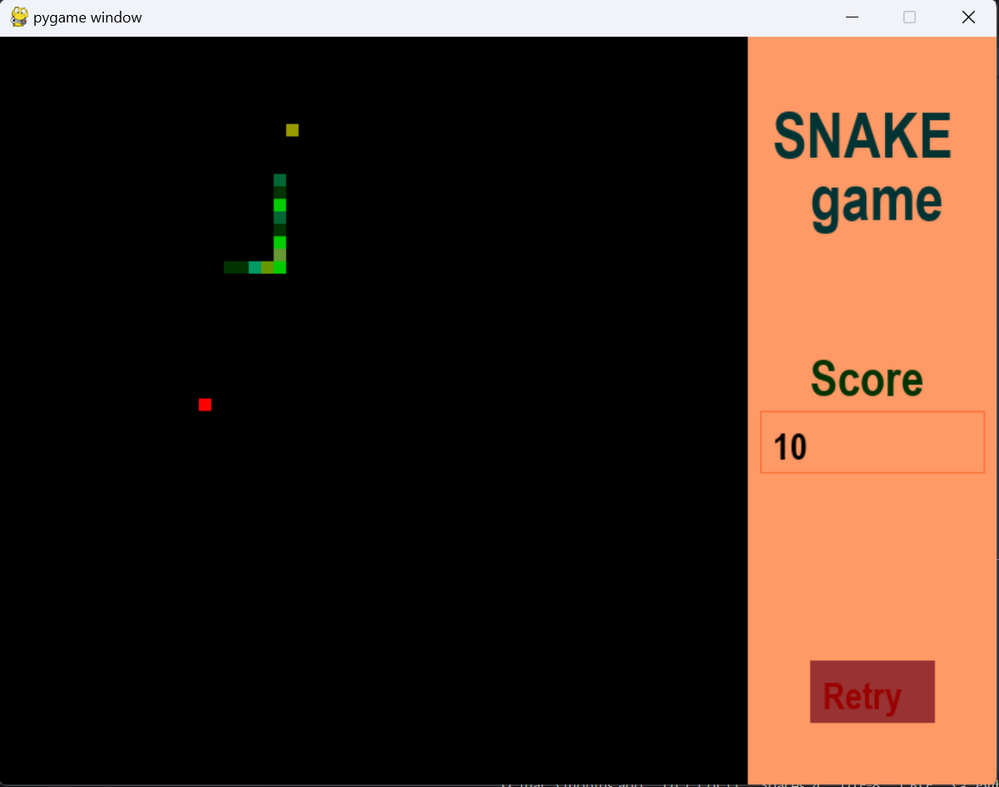
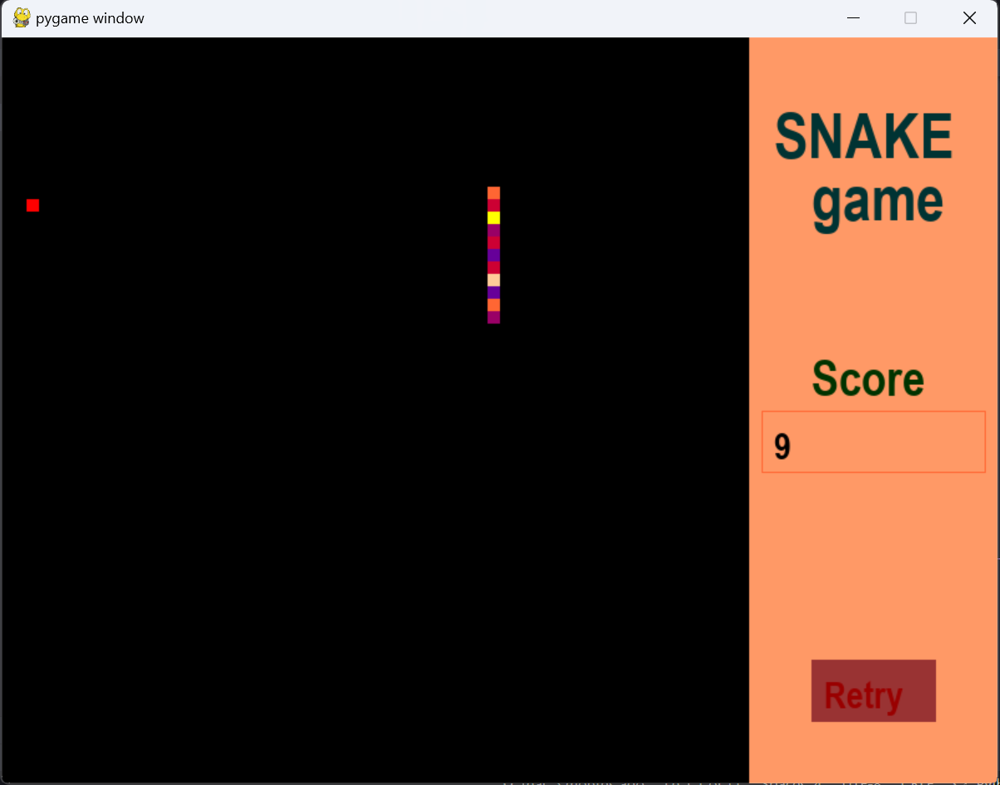
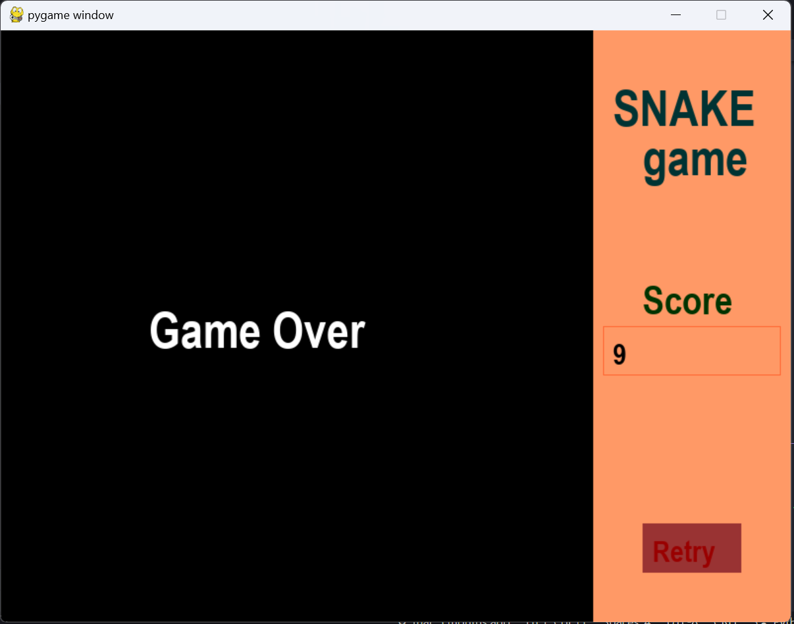

## Snake_game

- first you need to add requirement package by ruining this line
```bash
pip install -r requirements.txt
```

- now you can start the game using this line
```bash
py main.py
```

the snake will change color as it's moving around and it's also     


the snake will get sick and change its color once it ate its poop


Game Over when you hit the wall or it bit itself
